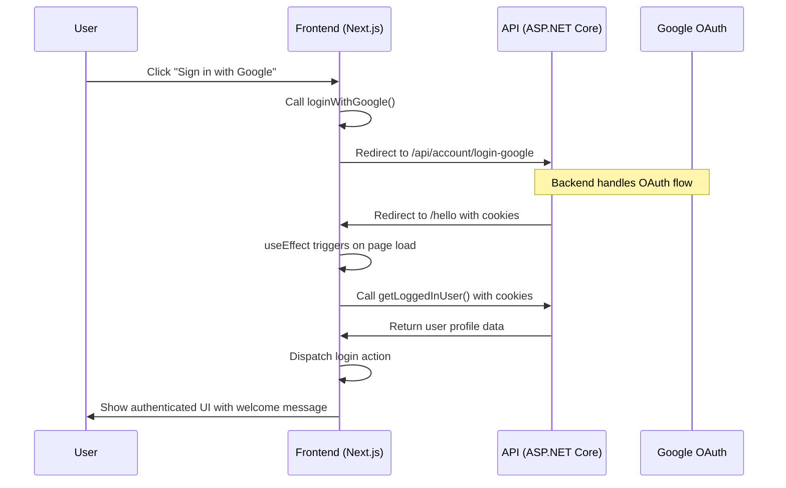

# Google OAuth Implementation - Frontend (Next.js)

## Overview

This document covers the client-side Google OAuth implementation in the Next.js web application. The frontend initiates the OAuth flow by redirecting to the backend API and handles the authenticated user state.

> **Note**: For backend implementation details, see [RandomRecipeGenerator.API/docs/GoogleOAuth.md](../../../RandomRecipeGenerator.API/docs/GoogleOAuth.md)

## Architecture

The frontend acts as the OAuth client:
```
Next.js Frontend → ASP.NET Core API → Google OAuth 2.0
                ←                   ←
```

## Dependencies

Install the required packages:

```bash
npm install react-google-button zod
npm install @reduxjs/toolkit react-redux  # for state management
npm install react-toastify                # for notifications
```

## Environment Configuration

Create a `.env.local` file in the project root:

```env
NEXT_PUBLIC_API_BASE_URL=https://localhost:7087
```

## Service Layer

### Base Service

The `baseService.ts` configures API requests with credentials for cross-origin authentication:

```typescript
interface GetOptions {
  credentials?: RequestCredentials
}

const get = async <T>(
  endpoint: string,
  options: GetOptions = {},
  context: string = 'data',
): Promise<T | null> => {
  try {
    const response = await fetch(
      `${process.env.NEXT_PUBLIC_API_BASE_URL}${endpoint}`,
      options,
    )

    if (!response.ok) {
      console.error(
        `Failed to get ${context}: ${response.status} ${response.statusText}`,
      )
      return null
    }

    return await response.json()
  } catch (error) {
    console.error(`Error getting ${context}`, error)
    return null
  }
}

export default get
```

### User Service

The `userService.ts` handles all authentication-related API calls:

```typescript
import { userSchema, User } from '@/schemas/userSchema'
import get from './baseService'
import validateData from '@/lib/validation'

export const loginWithGoogle = (): void => {
  window.location.href = `${process.env.NEXT_PUBLIC_API_BASE_URL}/api/account/login-google`
}

export const logoutWithGoogle = (): void => {
  window.location.href = `${process.env.NEXT_PUBLIC_API_BASE_URL}/api/account/logout`
}

export const getLoggedInUser = async (): Promise<User | null> => {
  const loggedInUser = await get<User>(
    '/api/account/user',
    { credentials: 'include' },
    'logged in user',
  )
  return validateData(loggedInUser, userSchema, 'logged in user')
}
```

## Data Schemas

### User Schema

Define the user data structure with Zod validation:

```typescript
import { z } from 'zod'

export const userSchema = z.object({
  email: z.string(),
  firstName: z.string(),
  lastName: z.string(),
})

export type User = z.infer<typeof userSchema>
```

## Components

### Google Sign-In Button

Create a reusable Google sign-in component:

```typescript
'use client'

import GoogleButton from 'react-google-button'
import { loginWithGoogle } from '@/services/userService'

export default function GoogleSignInButton() {
  return <GoogleButton onClick={() => loginWithGoogle()} />
}
```

### Post-Authentication Page

The `/hello` page handles the post-authentication flow:

```typescript
'use client'

import { useEffect, useState } from 'react'
import { getLoggedInUser } from '@/services/userService'
import { User } from '@/schemas/userSchema'
import { useAppSelector, useAppDispatch } from '@/store/hooks'
import { login, setLoading } from '@/store/features/auth/authSlice'
import Spinner from '@/components/common/Spinner'
import { toast } from 'react-toastify'

export default function Hello() {
  const dispatch = useAppDispatch()
  const { user, isLoading } = useAppSelector((state) => state.auth)
  const [error, setError] = useState<string | null>(null)
  const [hasChecked, setHasChecked] = useState<boolean>(false)

  useEffect(() => {
    const setLoggedInUser = async () => {
      try {
        dispatch(setLoading(true))
        setError(null)
        const loggedInUser: User | null = await getLoggedInUser()
        console.log('request logged in user!!!!!')
        if (loggedInUser === null) {
          return
        }
        dispatch(login(loggedInUser))
        toast.info(`Hello, Welcome ${loggedInUser.firstName}!`)
      } catch (error) {
        console.error('Error fetching user:', error)
        setError('An error occurred while fetching the user data')
      } finally {
        dispatch(setLoading(false))
        setHasChecked(true)
      }
    }

    if (user === null && !hasChecked && !isLoading) {
      setLoggedInUser()
    }
  }, [user, dispatch, hasChecked, isLoading])

  return (
    <div className="py-6">
      {error && <div className="mb-8 text-red-500">{error}</div>}
      {isLoading && <Spinner />}
      {!user && (
        <h1 className="mb-8 text-3xl font-bold tracking-tight">
          From the Hello page!!!!!!
        </h1>
      )}
      {user && (
        <h1 className="mb-8 text-3xl font-bold tracking-tight">
          Hello {user.firstName} {user.lastName}!
        </h1>
      )}
    </div>
  )
}
```

## State Management (Redux)

### Auth Slice

For managing authentication state, see the existing [REDUX_AUTH_DOCUMENTATION.md](./REDUX_AUTH_DOCUMENTATION.md) for detailed Redux setup.

Key actions:
- `login(user)` - Set authenticated user
- `logout()` - Clear user state
- `setLoading(isLoading)` - Manage loading state

## Authentication Flow (Frontend Perspective)



## Key Frontend Considerations

### 1. Cookie Management

- Authentication cookies are automatically handled by the browser
- Include `credentials: 'include'` in fetch requests
- Cookies are HttpOnly and secure (managed by backend)

### 2. Redirect Handling

- OAuth flow uses full page redirects (`window.location.href`)
- No need for popup windows or iframe handling
- Backend manages the complete OAuth flow

### 3. State Persistence

- User state persists across page refreshes via cookie validation
- The `/hello` page checks authentication status on page load
- Redux state is rehydrated on successful authentication

## Error Scenarios

### Common Frontend Issues

1. **CORS Errors**
   - Ensure `NEXT_PUBLIC_API_BASE_URL` matches backend CORS policy
   - Check that credentials are included in requests

2. **Authentication State Issues**
   - Verify Redux store is properly configured
   - Check that cookies are being sent with requests

3. **Redirect Loops**
   - Ensure `/hello` page doesn't redirect authenticated users
   - Check that authentication checks don't conflict

### Debugging Tips

1. **Check Network Tab**
   - Verify cookies are present in requests
   - Check API response status codes
   - Inspect request/response headers

2. **Console Logging**
   ```typescript
   const user = await getLoggedInUser()
   console.log('User data:', user) // Debug user retrieval
   ```

3. **Redux DevTools**
   - Monitor authentication state changes
   - Verify actions are dispatched correctly

## Security Best Practices

1. **Environment Variables**
   - Use `NEXT_PUBLIC_` prefix only for client-safe values
   - Never expose sensitive credentials in frontend code

2. **API Calls**
   - Always include credentials for authenticated requests
   - Validate response data with Zod schemas
   - Handle error responses gracefully

3. **State Management**
   - Clear sensitive data on logout
   - Don't store tokens in localStorage (handled by backend cookies)
   - Validate user data before storing in Redux

## Integration with Backend

The frontend coordinates with the backend through:

1. **Login Flow**: Redirects to backend OAuth endpoint
2. **Session Management**: Backend handles cookies automatically
3. **User Data**: Fetches profile via authenticated API call
4. **Logout**: Redirects to backend logout endpoint

For complete backend setup and configuration, refer to the [backend documentation](../../../RandomRecipeGenerator.API/docs/GoogleOAuth.md).

## Future Enhancements

The following features are planned but not yet implemented:

1. **Protected Routes**: Create a wrapper component for pages requiring authentication
2. **Dedicated Login Page**: Standalone login page with Google sign-in button
3. **Unit Testing**: Component and service testing with Jest and React Testing Library
4. **App-wide Authentication Check**: Check authentication status on initial app load, not just `/hello` page
5. **Role-based Authorization**: Support for different user roles and permissions 